# LIVE DEMO: https://onlinehtmleditor.herokuapp.com/

## License

    Copyright 2018 Chayan Datta

    from: https://help.github.com/articles/licensing-a-repository/
    This Project Doesn't have any Open source License so
    without a Open source license, the default copyright laws apply, meaning that you(me) retain all rights 
    to your(this) source code and no one may reproduce, distribute, or create derivative works from 
    your(this) work.
    
    See the License for the specific language governing permissions and
    limitations under the License.

    But if you want to work on this, you can just simply ask.
    
# LIVE DEMO: https://onlinehtmleditor.herokuapp.com/

Added features like save and clear button

# Step By Step process

# this is the first page you'll see

# Now Read this alert and click this cross(x) button to close this msg
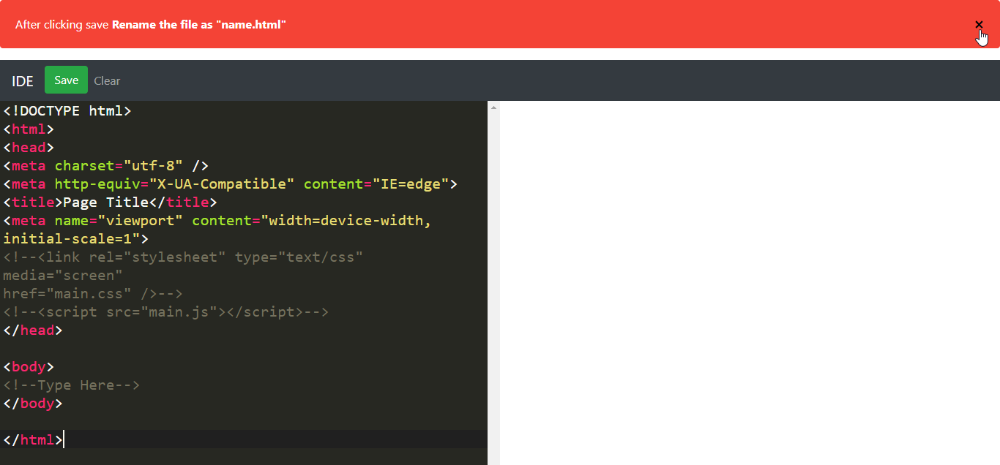
# No more alerts
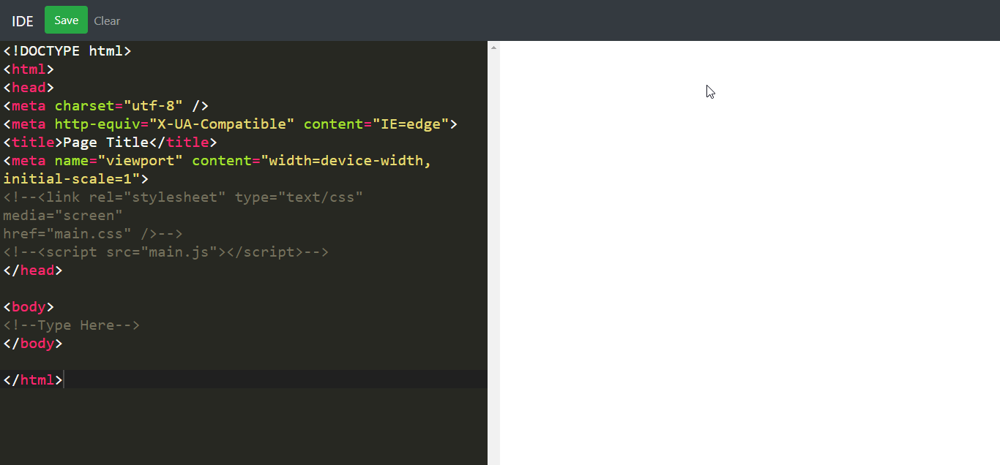
# Now Write whatever you want
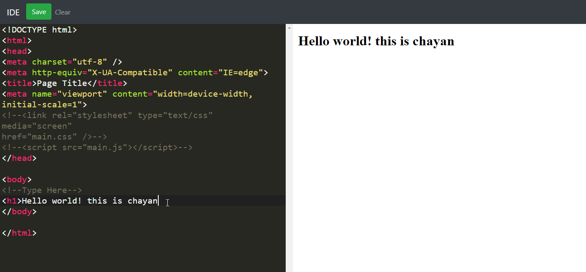
# go for the clear button
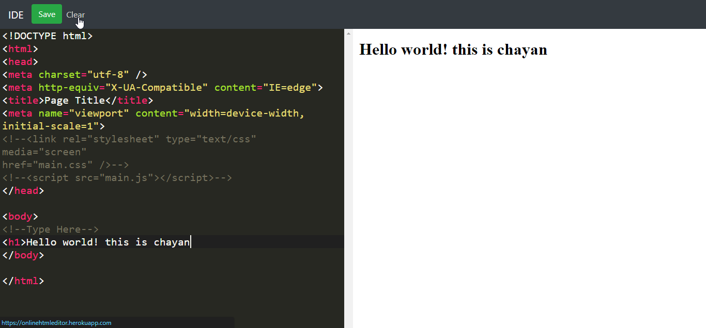
# All cleared

# go for the save button
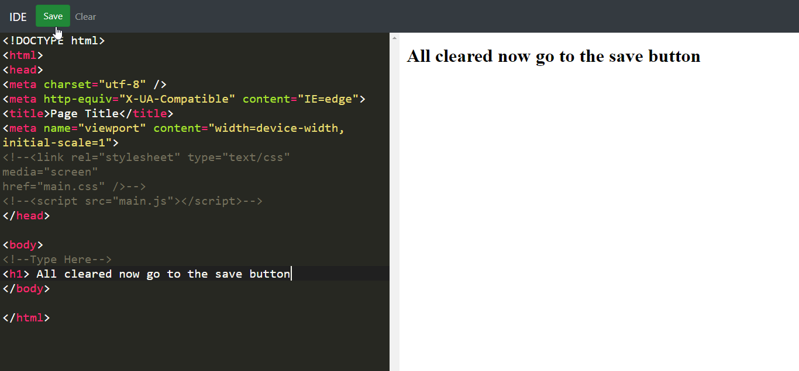
# you'll get a nice msg saying to save as .html
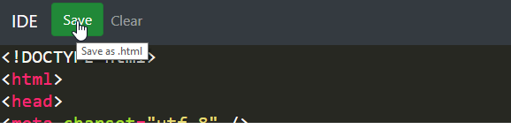
# You'll see a file downloaded like this
# Don't worry it's not a virus
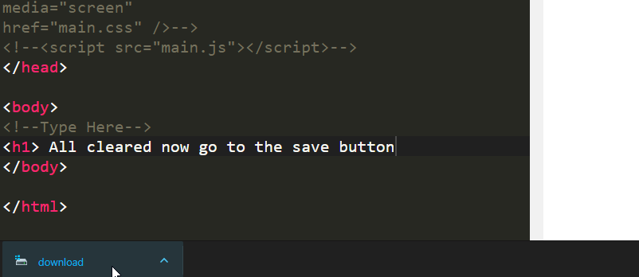
# Show in folder
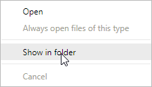
# Rename the file
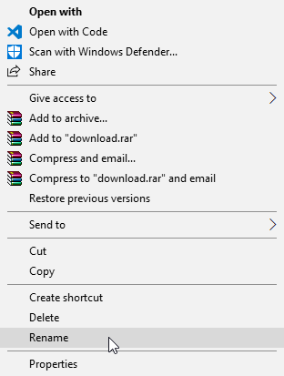
# Add .html after your file name
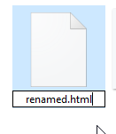
# Voila! 
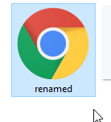
# Open like any html files
# Or open it using any editor

# LIVE DEMO: https://onlinehtmleditor.herokuapp.com/

